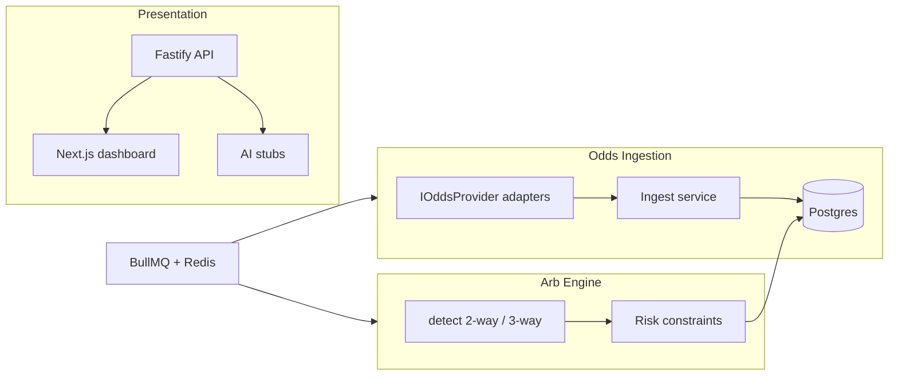

# Arb Intelligence Platform

Production-oriented **odds intelligence** system for theoretical arbitrage and positive-EV detection across multiple sportsbooks. This is **not** a gambling operator: it does not hold funds, accept wagers, or store sportsbook credentials.

## 🏦 The Fund (`apps/fund`)

The repo also ships a Python **multi-sleeve fund manager** that hunts for
+EV across three venues under one bankroll and risk manager:

- **markets** — multi-strategy Alpaca bot (mean reversion / momentum / trend, ATR sizing, hard stops)
- **polymarket** — copy-trades consistently profitable wallets from the public PnL leaderboard
- **sportsbook** — +EV vs the de-vigged Pinnacle line + cross-book arbitrage (paper, auto-settled)

Paper-first, fractional-Kelly sizing, daily loss limit, and a drawdown kill
switch. See [`apps/fund/README.md`](apps/fund/README.md).

## Architecture



| Layer | Location |
|-------|----------|
| Provider abstraction | `apps/api/src/providers/` |
| Ingestion | `apps/api/src/services/ingestion/` |
| Arb engine | `apps/api/src/services/arbEngine/` |
| Risk / bankroll | `apps/api/src/services/risk/` |
| AI boundary | `apps/api/src/services/ai/` |
| Jobs | `apps/api/src/jobs/` |
| Shared types | `packages/shared/` |
| Dashboard | `apps/web/` |

## Quick start

### 1. Infrastructure

```bash
docker compose up -d
cp .env.example .env
# Set THE_ODDS_API_KEY in .env (https://the-odds-api.com)
```

### 2. Install & database

```bash
npm install
npm run db:generate
npm run db:push -w @arb/api
npm run db:seed
```

### 3. Run services

```bash
# Terminal A — API
npm run dev:api

# Terminal B — workers (ingest + arb scan + AI explain)
npm run worker -w @arb/api

# Terminal C — dashboard
npm run dev:web
```

Open http://localhost:3000

### 4. One-shot debug scan

```bash
npm run scan -w @arb/api -- basketball_nba
```

Prints ingestion results and opportunities as JSON.

## API highlights

| Method | Path | Description |
|--------|------|-------------|
| GET | `/health` | Health check |
| GET | `/opportunities` | List opportunities (`minEdgePct`, `marketType`) |
| GET | `/opportunities/:id` | Detail + latest explanation |
| GET | `/opportunities/:id/execution-plan` | User-side execution assist JSON |
| POST | `/opportunities/:id/actions` | Log viewed / accepted / skipped / executed |
| POST | `/ai/explain-opportunity` | AI explanation (stub or LLM) |
| POST | `/auth/register` | Email + password signup |

## Legal / product constraints

- Bankroll is a **logical user setting**, not custodied funds.
- Execution is **assist + pre-fill** via `ExecutionPlan`; no server-side sportsbook login.
- UI copy uses *theoretical arbitrage* and *execution risk* language.
- Ontario-licensed books are seeded with `is_ontario_licensed` flags for filtering.

## Adding providers

1. Implement `IOddsProvider` (see `TheOddsApiProvider`).
2. Register in `apps/api/src/providers/registry.ts`.
3. Add sportsbook mappings in `prisma/seed.ts`.
4. Enable row in `odds_providers` table.

Stubs: `OpticOddsProvider`, future `SportsDataProvider`, `CustomScraperProvider`.

## Environment

See `.env.example`. Secrets stay in env vars only.

## Deploy on Vercel (frontend only)

The dashboard (`apps/web`) deploys to Vercel. The API (`apps/api`) should run elsewhere (Railway, Render, Fly, etc.) with Postgres + Redis.

### Required Vercel project settings

| Setting | Value |
|---------|--------|
| **Root Directory** | `apps/web` |
| **Framework Preset** | Next.js |
| **Build Command** | *(leave empty — uses `apps/web/vercel.json`)* |
| **Install Command** | *(leave empty)* |
| **Output Directory** | *(leave empty — default `.next`)* |

The web app is **self-contained** (no monorepo workspace install on Vercel).

**Important:** Framework must be **Next.js** and **Output Directory must be empty** (not `public`). See `apps/web/VERCEL.md`.

### Environment

- `NEXT_PUBLIC_API_URL` = your deployed API URL (e.g. `https://your-api.onrender.com`)

Redeploy after changing Root Directory or env vars.

## Next iterations

- Real LLM in `AiService` when `OPENAI_API_KEY` is set
- Value-bet detection vs consensus
- Player props edge scanner
- Email / Telegram notifications
- Browser extension consuming `/execution-plan`
